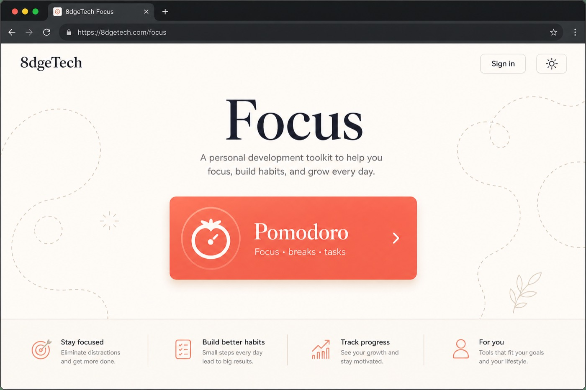
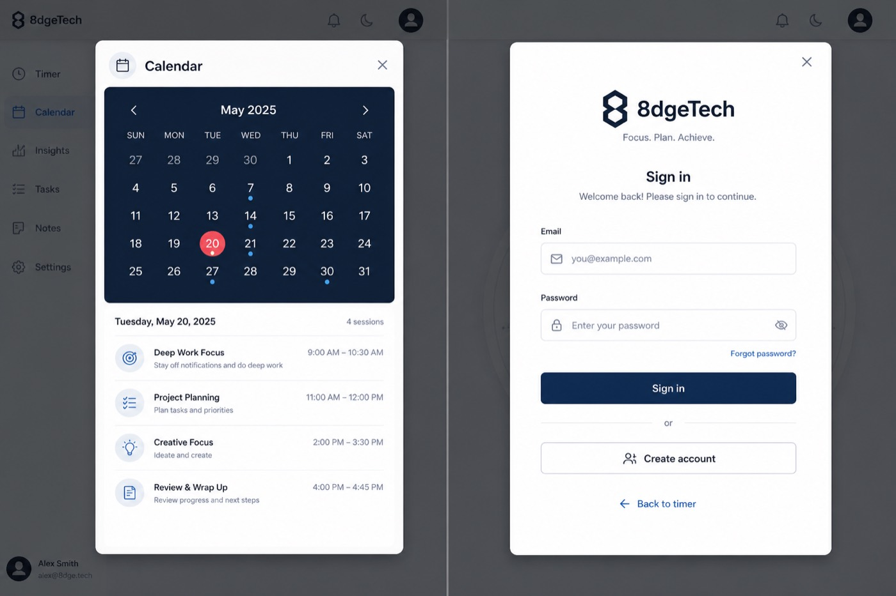
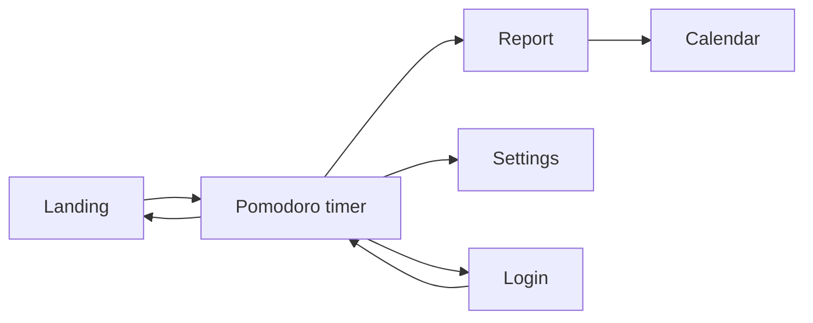

# 8dgeTech — Focus toolkit

Personal development toolkit by **8dgeTech** — one Expo app for **web, Android, and iOS**.

Start on a calm landing page, open tools when you need them. First module: a [Pomofocus](https://pomofocus.io/)-style **Pomodoro** timer with tasks, report, calendar, settings, and optional sign-in. Data stays **per user** (local for now; Supabase-ready later).

---

## What you’ll see

### 1. Landing — toolkit home

Pick a tool, toggle light/dark, sign in or continue as guest. Branding (**8dgeTech**) lives here — not on every screen.



| Area | What it does |
|------|----------------|
| **8dgeTech** | Company mark (header only) |
| **Focus** | Toolkit hero title |
| **Pomodoro card** | Opens the timer |
| **Sign in / theme** | Account + light/dark |

---

### 2. Pomodoro — focus timer

Same mental model as Pomofocus: modes, big clock, start/pause, tasks under the timer.


| Element | Details |
|---------|---------|
| **Modes** | Pomodoro · Short Break · Long Break (color shifts with mode) |
| **Timer** | Countdown + **START** / **PAUSE** |
| **Report / Setting / Login** | Top actions (no forced login) |
| **Tasks** | Estimates, active task, est. finish time |
| **Footer** | `powered by 8dgeTech@2026` |

Tap the **Pomodoro** title to return to the landing page.

---

### 3. Report & Settings

Sheet/dialog overlays (not full-screen) — same pattern on desktop and mobile.


**Report**
- Today / focus totals  
- Last 7 days chart  
- Link to **Calendar**  

**Settings**
- Pomodoro / short / long durations  
- Auto-continue between phases  
- Reset to defaults  

---

### 4. Calendar & Sign in



**Calendar** — month grid + day agenda (sessions & tasks).  
**Sign in** — optional email/password; **Back to timer** keeps guest mode. Logout clears the guest workspace; account data stays for next login.

---

## How it flows



```text
Landing
   │
   ▼
Pomodoro ── Report ──► Calendar
   │
   ├── Setting
   └── Login (optional) ──► back to timer
```

1. Open the app → **landing**  
2. Open **Pomodoro** → use the timer without signing in  
3. Add tasks, run focus / break cycles  
4. Check **Report** / **Calendar**, tweak **Setting**  
5. **Login** when you want your own saved workspace  

---

## Features at a glance

| Feature | Status |
|---------|--------|
| Toolkit landing + registry | ✅ |
| **Pulse** — Pomodoro timer | ✅ |
| **Drift** — catch distractions | ✅ |
| **Depth** — deep-work blocks | 🔜 stub |
| Tasks + estimates + active task | ✅ |
| Report + 7-day chart | ✅ |
| Calendar (day agenda) | ✅ |
| Settings sheet | ✅ |
| Guest or signed-in (per-user data) | ✅ |
| Light / dark + soft doodles | ✅ |
| Web + Android + iOS (Expo) | ✅ |
| Cloud sync (Supabase) | 🔜 SQL stub ready |

---

## Stack

- **Expo SDK 57** + Expo Router + TypeScript  
- React Native Web  
- Local-first storage (per user id)  
- `supabase/` SQL stub for future sync  

## Project layout

```text
app/                         # Expo Router routes (thin wrappers)
public/                      # Web static assets (.htaccess, doodles)
src/
  public/                    # Shared suite platform (auth, theme, storage, supabase, registry)
  apps/                      # One folder per product
    pulse/                   # Pomodoro — data · domain · presentation
    drift/                   # Distraction awareness
    depth/                   # Stub for future deep-work app
    catalog.ts               # Module map for shipped / stub apps
  shell/                     # Suite chrome (landing, sign-in, admin)
supabase/                    # Backend SQL
docs/screenshots/
```

Add another tool:
1. Create `src/apps/<id>/` (domain / data / presentation + `index.ts`)
2. Register in `src/public/registry/appRegistry.ts` and `src/apps/catalog.ts`
3. Add `app/<route>.tsx` and a `Stack.Screen` in `app/_layout.tsx`
4. Keep shared code in `src/public` — never duplicate theme/auth/storage into an app folder

Root `public/` is for static web files only; shared **code** lives in `src/public`.
---

## Run locally

```bash
cd "Personal Development Tools/8dgetech-focus"
npm install          # or yarn
npx expo start
```

Then press **`w`** (web), **`a`** (Android), or **`i`** (iOS).

---

## Host on Hostinger (web)

Live URL target: **https://8dgetech.com/en/portfolio**

The app is built with `experiments.baseUrl: "/en/portfolio"` so assets and routes work under that path. **Do not** replace your existing site root — only add a subfolder.

### Folder on Hostinger

| Your URL | Upload files here |
|----------|-------------------|
| `https://8dgetech.com/en/portfolio` | `public_html/en/portfolio/` |

Leave the rest of `public_html` (homepage, `/en`, etc.) untouched.

```text
public_html/                 ← existing 8dgetech.com site (keep)
  en/
    …                        ← existing English pages (keep)
    portfolio/               ← CREATE this folder
      index.html             ← from dist/
      .htaccess
      _expo/                 ← from dist/ (or similar asset folders)
      …
```

### 1. Build on your machine

```bash
cd "Personal Development Tools/8dgetech-focus"
npm install
npm run build:web
```

Creates **`dist/`** with paths already prefixed for `/en/portfolio`.

### 2. Upload only into `/en/portfolio`

1. hPanel → **Files → File Manager**
2. Open **`public_html` → `en`**
3. Create folder **`portfolio`** if it doesn’t exist
4. Open **`public_html/en/portfolio`**
5. Upload **everything inside `dist/`** into that folder  
   (so `public_html/en/portfolio/index.html` exists)
6. Confirm **`.htaccess`** is in `portfolio/` (comes from `public/.htaccess`)

### 3. Open the app

Visit: [https://8dgetech.com/en/portfolio](https://8dgetech.com/en/portfolio)

Timer: `https://8dgetech.com/en/portfolio/pomodoro`

### Updating later

```bash
npm run build:web
# replace contents of public_html/en/portfolio/ with the new dist/ files
```

> Local `npx expo start` still uses `/` (baseUrl applies to the production export). Always rebuild before uploading.

---

## Notes

- Screenshots above are **UI previews** of the intended experience (layout & flows match the app).  
- Company name is **8dgeTech** only — landing header, powered-by line, sign-in.  
- Built for portfolio / personal use; not affiliated with Pomofocus.
