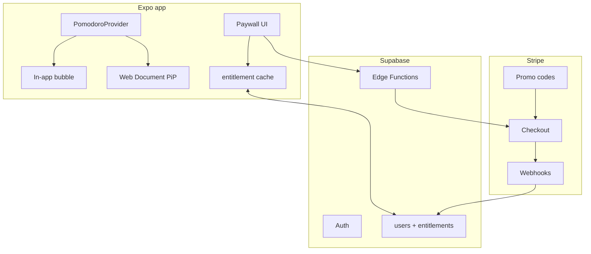

# Plan: floating timer, trial, coupons, licensing, Pro payments

Status: Phase 1 implemented (in-app bubble). Phases 2–8 not started.  
App: 8dgeTech Focus (Expo SDK 57 — web, iOS, Android)  
Live web: https://8dgetech.com/en/portfolio

This plan covers five product goals:

1. Minimal always-visible timer bubble (mobile + desktop)
2. 7-day trial
3. Coupon options
4. How to license the app
5. Payment for Pro features

---

## Current constraints

- Timer state is lifted into `PomodoroProvider` (root). Leaving Pomodoro no longer unmounts the timer.
- Auth is local (`authStore` + `localStorage`). Guests and accounts are not a billing identity.
- No backend for entitlements. The `supabase/` SQL stub is sessions-only.
- Web is hosted on Hostinger. Native store builds are not the first payment surface.
- Web already sets `document.title` to remaining time while on the Pomodoro screen.

**Do not** store “is Pro” or “trial started” only on the device. Anyone can edit `localStorage`.

---

## Prerequisites (do first)

### A. Lift the timer to app-global state

Move session state (`remaining`, `running`, `phase`, `endsAt`) out of `PomodoroScreen` into a `PomodoroProvider` in `app/_layout.tsx` (same pattern as `AuthProvider`).

- Prefer wall-clock `endsAt`, not only `setInterval`, so background/tab-sleep stays accurate.
- Then a bubble can exist on Home, Calendar, etc., and the clock keeps ticking.

### B. Real backend for billing

Replace local auth as the source of truth for paid status.

- **Supabase Auth** for real users
- **Entitlements table** as source of truth
- Client only **caches** entitlements

Suggested order: **global timer → in-app bubble → entitlements/paywall → Stripe (web) → stores later**.

---

## 1. Always-on-top timer bubble

“On top of everything” means different things per platform. Browsers and iOS will not let a web/Expo app float over *other* apps the way a Messenger chat-head does.

### What you can actually ship

| Surface | Always on top of… | How |
|---|---|---|
| **In-app (all platforms)** | Other screens in Focus | Floating bubble in root layout |
| **Web (Chrome/Edge)** | Other windows (best effort) | Document Picture-in-Picture |
| **Desktop app** | All windows | Electron/Tauri `alwaysOnTop` |
| **Android** | Other apps | Overlay permission + native bubble |
| **iOS** | Lock screen / Dynamic Island, not other apps | Live Activity |
| **Web Safari / PWA** | Not other apps | Tab title + in-app bubble |

### Phase 1 — in-app bubble (done)

Works on web, iOS, and Android with the current stack.

1. `PomodoroProvider` at root with `endsAt` (`src/features/pomodoro/presentation/PomodoroProvider.tsx`).
2. In `_layout.tsx`, render a small circular overlay when `running`, mid-session, or minimized:
   - time (`25:00`)
   - phase color
   - tap → `/pomodoro`
   - drag with `react-native-gesture-handler` (snaps to left/right edge)
3. On the full Pomodoro screen, hide the bubble and show a minimize control (also triggered by the Pomodoro back title).

This is the same UX as a chat head **inside** the toolkit.

### Phase 2 — web pop-out (desktop browser)

Chrome/Edge support **Document Picture-in-Picture**: a tiny always-on-top window with custom HTML (timer + pause).

- User gesture required (`requestWindow`)
- Not Safari, not Firefox (yet)
- Keep `document.title` as fallback

`window.open` with a tiny popup is **not** always-on-top; the OS can bury it.

True desktop “always on top of every app” needs a **desktop shell** (Tauri is lighter than Electron): a frameless, always-on-top window ~120×120 that reads the same timer state. That is a separate product surface, not Expo Web on Hostinger.

### Phase 3 — lock screen (scaffolded)

Spotify-style lock screen is **Now Playing** (media). A Pomodoro uses **Live Activities** (iOS) and a **foreground sticky notification** (Android). Android has no Dynamic Island; the status-bar “chip” needs Android 16 Live Updates (Phase B, later).

Implemented in `src/features/pomodoro/data/lockScreenTimer.ts`:

- **iOS Live Activity** (`expo-live-activity`): countdown on Lock Screen + Dynamic Island using `endsAt`. The system ticks even when the app is backgrounded. **Not available in Expo Go** — needs a development/production build and an Apple Developer account.
- **Android lock-screen timer** (`androidLockScreen.ts` + `react-native-sticky-notification`): foreground service + sticky notification with ticking remaining time and **Pause / Resume / Open** actions. Config plugin: `plugins/withAndroidFocusTimer.js`.
- **Notifications** (`expo-notifications`): session-end alert on both platforms.

To see it on a physical Android device:

1. `eas build --profile development --platform android` (or `npx expo run:android`)
2. Install the build, allow notifications, start a Pomodoro, lock the phone

**Pro split:** free = full screen + tab title; Pro = minimize bubble + PiP / Live Activity / Android overlay.

---

## 2. 7-day trial

Do **not** store “trial started” only on the device.

### Model

```text
users
  id, email, trial_started_at, trial_ends_at, plan (free|trial|pro)

entitlements
  user_id, feature, active_until, source (trial|stripe|app_store|coupon)
```

### Flow

1. User signs up (real account — guests should not get a durable trial, or fingerprint + convert on signup).
2. Server sets `trial_ends_at = now + 7 days`.
3. Client: `isPro = plan === 'pro' || (plan === 'trial' && now < trial_ends_at)`.
4. When trial ends, paywall; data stays, Pro UI locks.

### If subscriptions are used later

| Channel | Native trial |
|---|---|
| **Stripe** | `trial_period_days: 7` on the Subscription |
| **App Store** | Introductory offer (7 days free) on the IAP |
| **Play** | Free trial on the subscription |
| **RevenueCat** | One offering with a 7-day trial; it maps to each store |

Use **either** our own 7-day clock **or** the store’s introductory trial — not both stacked.

Gate Pro features in one helper, e.g. `useEntitlement('floating_timer')`, never scattered `if`s.

---

## 3. Coupon options

Treat coupons as **server-validated**, never a hardcoded string in the app.

### Web / Stripe (fits Hostinger + later Supabase)

- Stripe **Coupons** (percent or amount off) + **Promotion codes** (`WELCOME20`).
- Checkout: `allow_promotion_codes: true` and/or a field that sends `discounts: [{ promotion_code }]`.
- 100% off / “lifetime Pro” = Stripe coupon at 100% **or** a custom table:

```text
coupons (code, type: percent|duration|grant_pro, max_redemptions, expires_at)
coupon_redemptions (code, user_id, redeemed_at)
```

Redeem endpoint: check code → mark used → set `plan = pro` (or attach Stripe discount).

### App Store / Play (only if native is shipped)

- Apple: offer codes / promo codes (not arbitrary “SAVE20” in our UI).
- Google: Play promo codes.
- RevenueCat can unify some of this; web codes still will not apply to IAP prices.

**Practical split:** custom codes + Stripe on **web** (live site today). Store promo codes only when publishing to stores.

---

## 4. How to license the app

Three different meanings — all three are needed.

### A. Source / product license (publisher)

This repo is a commercial product, not an MIT library.

- **Proprietary EULA** (Terms of Use): personal use, no redistribution, Pro is licensed not sold.
- **Privacy policy** (required before Stripe / App Store).
- Keep the app **private** on GitHub if the code should not be copied.

### B. User license (what they buy)

Prefer **account-based entitlement**, not typed-in license keys:

```text
Sign in → server says { plan, expiresAt, features[] }
```

License keys (`XXXX-XXXX`) fit boxed desktop software. They still need a server for generate / bind / refund. Extra complexity for little gain on a web+mobile app.

If a **one-time desktop license** (Tauri) is sold later, then a key + machine binding can make sense. For Focus-on-the-web, **login = license**.

### C. Store listing license

- Apple/Google: paid app or IAP; their ToS are the store license.
- Web: Terms + Stripe invoice is the license.

---

## 5. Payment for Pro features

### Store rules

If Focus is on the **App Store / Play Store**, digital Pro unlocks **must** use Apple/Google billing. Stripe-only IAP on iOS will be rejected.

Today the product is **web on Hostinger**, so **Stripe on the web** is the first payment path. Add RevenueCat/IAP when submitting native builds.

### Recommended stack

```text
Expo app
  → Supabase Auth (replace local authStore)
  → entitlements table (source of truth)
  → Stripe Checkout (web Pro)
  → Stripe webhooks → update entitlements
  later: RevenueCat for iOS/Android (same entitlement keys)
```

### Stripe Checkout flow

1. User taps “Go Pro”.
2. App calls a Supabase Edge Function `create-checkout-session` with `user_id` + price id.
3. Redirect to Stripe Checkout (card, Apple Pay, Google Pay).
4. Webhook `checkout.session.completed` / `customer.subscription.updated` writes `plan = pro`.
5. App refreshes entitlement; paywall disappears.

Use **Customer Portal** for cancel/update card so billing UI is not built in-app.

### Pricing models

| Model | When to use |
|---|---|
| Monthly/yearly subscription | Ongoing Pro (themes, reports, overlay, sync) |
| Lifetime one-time | Simple; Stripe PaymentIntent; no Stripe trial (use our 7-day trial instead) |
| Hybrid | Trial → subscribe, plus a “lifetime” coupon/price |

Start with **one product**: e.g. Pro yearly + 7-day trial. Coupons on top.

### What to put behind Pro

| Free | Pro |
|---|---|
| Timer, tasks, guest use | Cloud sync across devices |
| Basic report | Full calendar / history |
| | Floating bubble / PiP / Live Activity |
| | Extra sounds, custom durations beyond a cap, etc. |

Do not lock the core timer if people should finish the trial.

### Paywall UX

- Soft gate: feature dimmed + “Pro · 7-day trial”.
- Hard gate: sheet with trial CTA, then Checkout.
- Restore: on web = “Sign in”. On stores = Restore Purchases.

### Feature flag in code

One module (`src/core/billing/`) — entitlements, paywall, Stripe/RevenueCat adapters. Do not sprinkle `user.plan === 'pro'` through Pomodoro.

```ts
const { canUse } = useEntitlement();
if (!canUse('pip_bubble')) {
  showPaywall('Stay on top while you work in other apps');
  return;
}
```

---

## Architecture



---

## Suggested build order

1. **Global timer + in-app bubble** — no billing yet; proves the UX.
2. **Supabase Auth** — replace local accounts so trials/payments attach to a real user.
3. **Entitlements + 7-day trial** — even before taking money.
4. **Stripe Checkout + webhook + Customer Portal** — Pro on https://8dgetech.com/en/portfolio.
5. **Promotion codes** in Stripe + optional custom “grant Pro” codes.
6. **Web PiP** as a Pro feature.
7. **Legal**: Terms, Privacy, EULA.
8. **Native later**: Live Activities (iOS), overlay + foreground service (Android), IAP via RevenueCat using the same entitlement names.

---

## Bottom line

- The bubble is mostly a **timer-state + overlay** problem. OS-level “over other apps” only on Android / a desktop wrapper / Chrome PiP.
- Trial, coupons, licensing, and Pro payments are one **entitlement system** on Supabase + Stripe for web.
- Do not implement paid status as local flags.
