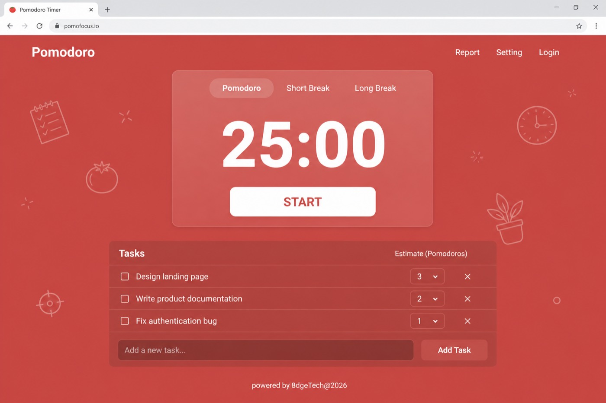
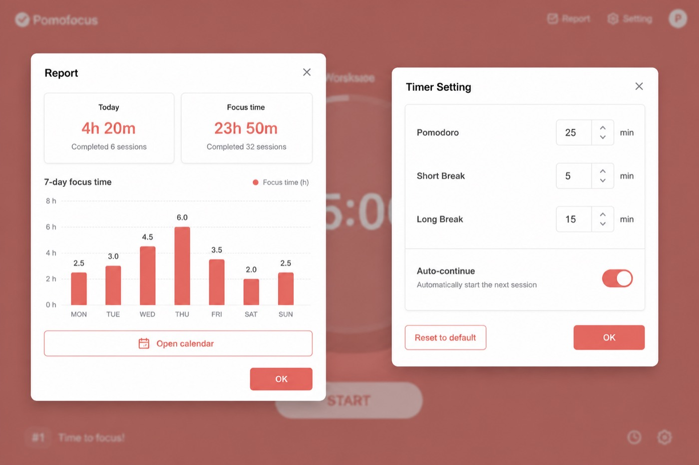
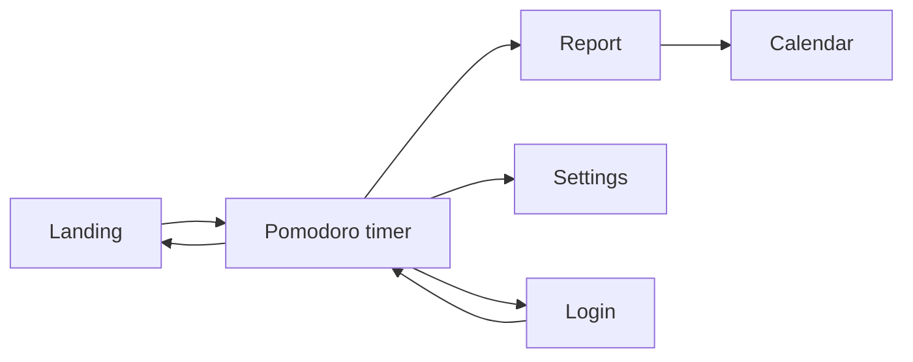

# 8dge Focus

Personal development toolkit by **8dgeTech** — one Expo app for **web, Android, and iOS**.

Start on a calm landing page, open tools when you need them. First module: a [Pomofocus](https://pomofocus.io/)-style **Pomodoro** timer with tasks, report, calendar, settings, and optional sign-in. Data stays **per user** (local for now; Supabase-ready later).

---

## What you’ll see

### 1. Landing — toolkit home

Pick a tool, toggle light/dark, sign in or continue as guest. Branding (**8dgeTech**) lives here — not on every screen.


| Area | What it does |
|------|----------------|
| **8dgeTech** | Company mark (header only) |
| **Focus** | Product hero |
| **Pomodoro card** | Opens the timer |
| **Sign in / theme** | Account + light/dark |

---

### 2. Pomodoro — focus timer

Same mental model as Pomofocus: modes, big clock, start/pause, tasks under the timer.



| Element | Details |
|---------|---------|
| **Modes** | Pomodoro · Short Break · Long Break (color shifts with mode) |
| **Timer** | Countdown + **START** / **PAUSE** |
| **Report / Setting / Login** | Top actions (no forced login) |
| **Tasks** | Estimates, active task, est. finish time |
| **Footer** | `powered by 8dgeTech@2026` |

Tap the **Pomodoro** title to return to the landing page.

---

### 3. Report & Settings

Sheet/dialog overlays (not full-screen) — same pattern on desktop and mobile.



**Report**
- Today / focus totals  
- Last 7 days chart  
- Link to **Calendar**  

**Settings**
- Pomodoro / short / long durations  
- Auto-continue between phases  
- Reset to defaults  

---

### 4. Calendar & Sign in


**Calendar** — month grid + day agenda (sessions & tasks).  
**Sign in** — optional email/password; **Back to timer** keeps guest mode. Logout clears the guest workspace; account data stays for next login.

---

## How it flows



```text
Landing
   │
   ▼
Pomodoro ── Report ──► Calendar
   │
   ├── Setting
   └── Login (optional) ──► back to timer
```

1. Open the app → **landing**  
2. Open **Pomodoro** → use the timer without signing in  
3. Add tasks, run focus / break cycles  
4. Check **Report** / **Calendar**, tweak **Setting**  
5. **Login** when you want your own saved workspace  

---

## Features at a glance

| Feature | Status |
|---------|--------|
| Toolkit landing + registry | ✅ |
| Pomodoro / short / long breaks | ✅ |
| Tasks + estimates + active task | ✅ |
| Report + 7-day chart | ✅ |
| Calendar (day agenda) | ✅ |
| Settings sheet | ✅ |
| Guest or signed-in (per-user data) | ✅ |
| Light / dark + soft doodles | ✅ |
| Web + Android + iOS (Expo) | ✅ |
| Cloud sync (Supabase) | 🔜 SQL stub ready |

---

## Stack

- **Expo SDK 57** + Expo Router + TypeScript  
- React Native Web  
- Local-first storage (per user id)  
- `supabase/` SQL stub for future sync  

## Project layout

```text
app/                         # Expo Router routes
src/
  core/                      # theme, auth, storage, doodles
  registry/                  # enable/disable mini-apps
  features/
    home/                    # landing
    auth/                    # sign-in
    pomodoro/                # data · domain · presentation
supabase/                    # future backend stub
docs/screenshots/            # README visuals
```

Add another tool: create `src/features/<name>/`, register it in `src/registry/appRegistry.ts`, add a route under `app/`.

---

## Run locally

```bash
cd "Personal Development Tools/eightedge-focus"
npm install          # or yarn
npx expo start
```

Then press **`w`** (web), **`a`** (Android), or **`i`** (iOS).

---

## Notes

- Screenshots above are **UI previews** of the intended experience (layout & flows match the app).  
- Company name appears sparingly: landing header, powered-by line, sign-in.  
- Built for portfolio / personal use; not affiliated with Pomofocus.
